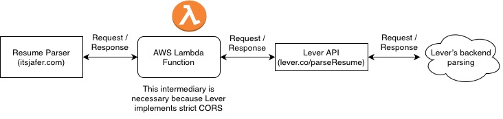

# Resume Parser

**Update**: The API that this project used has been obfuscated and therefore this tool is no longer functional. :(

This repo hosts the Google Cloud function for querying Lever's resume parsing API.

While the Lever API is (probably unintentionally) public, it implements strict CORS. This lambda function is used as a proxy to facilitate server-to-server communication.

You can view a live demo [here](https://itsjafer.com/#/parser) which calls this cloud function (whose trigger URL is `https://us-central1-resume-parser-322517.cloudfunctions.net/parseResume-1`)

## How does this work?

Lever.co is a popular recruiting platform used by many companies. As job applicants, we often encounter Lever when applying for jobs. When applying to a job posting powered by Lever, if you pay attention to the network requests being made, you'll notice that a call to an internal Lever API is made. In particular, a post request is made to `https://jobs.lever.co/parseResume` which parses the resume through Lever's backend. My website is simply a front-end that displays the results of the parse in an easy-to-digest manner.

Note that the diagram is a bit outdated, I've switched from AWS Lambda to GCP Cloud Functions (which is a lot easier to use).
